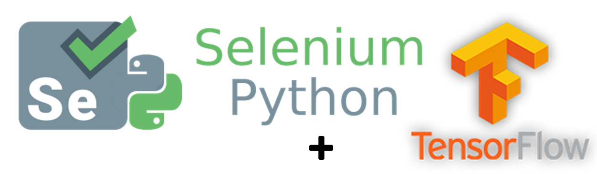

# Machine Learning with Selenium and TensorFlow

<!-- PROJECT SHIELDS -->
[![Build Status][build-shield]]()
[![Contributors][contributors-shield]]()
[![MIT License][license-shield]][license-url]
[![LinkedIn][linkedin-shield]][linkedin-url]


<!-- PROJECT LOGO -->
<br />
<p align="center">
  <a href="https://github.com/dasxran/seleniumMachineLearning">
    
  </a>
</p>


<!-- TABLE OF CONTENTS -->
## Table of Contents

* [About the Project](#about-the-project)
  * [Built With](#built-with)
* [Getting Started](#getting-started)
  * [Prerequisites](#prerequisites)
  * [Installation](#installation)
* [Usage](#usage)
* [Contributing](#contributing)
* [License](#license)
* [Contact](#contact)
* [Acknowledgements](#acknowledgements)


<!-- ABOUT THE PROJECT -->
## About The Project

[![Product Name Screen Shot][product-screenshot]](https://github.com/dasxran/seleniumMachineLearning)

Train a Tensorflow model [based on Inception V3](https://cloud.google.com/tpu/docs/tutorials/inception) with custom set of images and apply the model to identify objects in a webpage with the help of selenium.

A list of commonly used resources that I find helpful are listed in the acknowledgements.

### Built With
* [TensorFlow](https://www.tensorflow.org/)
* [Docker](https://www.docker.com/)
* [Selenium](https://www.seleniumhq.org/)
* [And a bunch of python libraries](https://www.python.org/)


<!-- GETTING STARTED -->
## Getting Started

This is an example of how you may give instructions on setting up your project locally.
To get a local copy up and running follow these simple example steps.

### Prerequisites

This is the list of things you need to have in your system.
1. Get [Docker Desktop](https://www.docker.com/products/docker-desktop) to pull Tensorflow images
2. Have [Python](https://www.python.org/downloads/) installed in the system
3. Install [PyCharm IDE](https://www.jetbrains.com/pycharm/) (Optional) to edit/run the code

### Installation

1. Clone the repo
```sh
git clone https://github.com/dasxran/seleniumMachineLearning.git
```
2. Pull [Tensorflow image](https://hub.docker.com/r/dasxran/tensorflow) from Docker hub
```sh
docker pull dasxran/tensorflow
```


<!-- USAGE EXAMPLES -->
## Usage

TBW...


<!-- CONTRIBUTING -->
## Contributing

Contributions are what make the open source community such an amazing place to be learn, inspire, and create. Any contributions you make are **greatly appreciated**.

1. Fork the Project
2. Create your Feature Branch (`git checkout -b feature/AmazingFeature`)
3. Commit your Changes (`git commit -m 'Add some AmazingFeature`)
4. Push to the Branch (`git push origin feature/AmazingFeature`)
5. Open a Pull Request


<!-- LICENSE -->
## License

Distributed under the MIT License. See `LICENSE` for more information.


<!-- CONTACT -->
## Contact

Ranjan Kumar Das - ranjankrdas09@gmail.com

Project Link: [https://github.com/dasxran/seleniumMachineLearning](https://github.com/dasxran/seleniumMachineLearning)


<!-- ACKNOWLEDGEMENTS -->
## Acknowledgements
* [Medium blog on TensorFlow](https://medium.com/@teavanist/image-classification-using-tensorflow-on-docker-windows-bd7824b05fee)


<!-- MARKDOWN LINKS & IMAGES -->
[build-shield]: https://img.shields.io/badge/build-passing-brightgreen.svg?style=flat-square
[contributors-shield]: https://img.shields.io/badge/contributors-1-orange.svg?style=flat-square
[license-shield]: https://img.shields.io/badge/license-MIT-blue.svg?style=flat-square
[license-url]: https://choosealicense.com/licenses/mit
[linkedin-shield]: https://img.shields.io/badge/-LinkedIn-black.svg?style=flat-square&logo=linkedin&colorB=555
[linkedin-url]: https://linkedin.com/in/othneildrew
[product-screenshot]: https://raw.githubusercontent.com/othneildrew/Best-README-Template/master/screenshot.png
